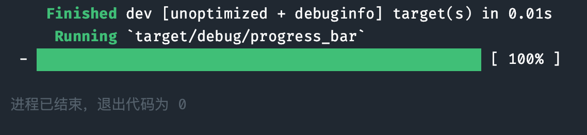

# Rust built Progress Bar 
A Progress Bar built by Rust.

## Introduction
The effect is as follows:   \
    \

## How to use
- To clone the repository, you can use `git clone https://github.com/BoningtonChen/progress-bar_rs.git`
- The project was built dependent on `rustc 1.73.0-nightly`

## LICENSE
The project uses `GNU GENERAL PUBLIC LICENSE Version 3`.

## Copyright
© Bonity, 2023